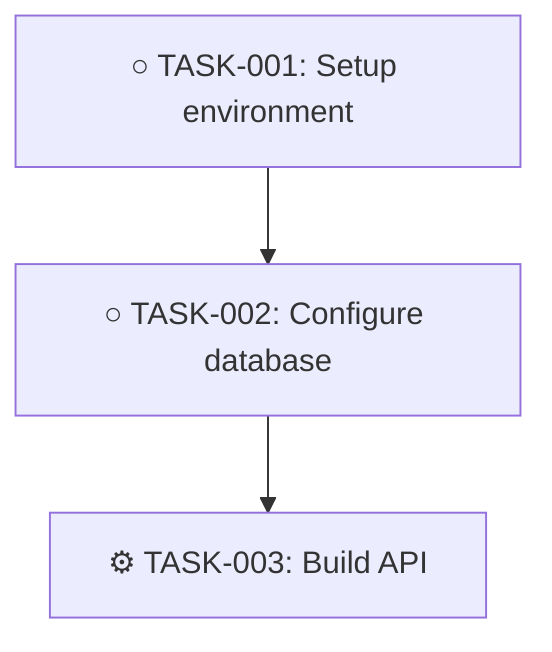

# Task Dependency Detection

This script analyzes tasks in `TASKS.md` to automatically detect dependencies and relationships between tasks.

## Features

- **Explicit Reference Detection**: Finds direct TASK-XXX references in task descriptions
- **Keyword Analysis**: Detects dependency keywords ("after", "before", "requires", "depends on", etc.)
- **Contextual Analysis**: Identifies prerequisite and follow-up tasks based on context
- **Circular Dependency Detection**: Identifies circular dependencies that could cause blockers
- **Dependency Visualization**: Generates Mermaid diagrams of task relationships
- **Confidence Scoring**: Rates each detected dependency by confidence level

## Usage

### Command Line

```bash
python3 .template/aiScripts/detectTaskDependencies/detectTaskDependencies.py aiDocs/TASKS.md
```

### Output Files

The script generates two files in the `aiDocs/` directory:

1. **TASK_DEPENDENCY_REPORT.md** - Comprehensive analysis including:
   - Summary statistics
   - High-confidence dependencies (>= 80%)
   - Medium-confidence dependencies (50-80%)
   - Circular dependency warnings
   - Critical path analysis (tasks with no dependencies)

2. **TASK_DEPENDENCY_GRAPH.md** - Mermaid diagram visualization of the task dependency graph

## Dependency Detection Methods

### 1. Explicit References
Detects direct mentions of task IDs in descriptions:
- "After TASK-001 is complete"
- "Requires TASK-005 to be done"
- "Blocked by TASK-003"

**Confidence: 95%**

### 2. Keyword Patterns
Identifies dependency keywords:

**Blocking relationships:**
- after, once, when [task] is complete
- requires [task] to be complete
- depends on [task]
- blocked by [task]
- waiting for/on [task]
- needs [task] first

**Related relationships:**
- related to [task]
- similar to [task]
- connected with [task]
- see also [task]

**Confidence: 60%**

### 3. Contextual Analysis
Analyzes task context for implicit dependencies:

**Prerequisite indicators:**
- setup, install, configure, initialize, prepare

**Follow-up indicators:**
- cleanup, verify, test, review, document

**Sequential indicators:**
- first, second, third, next, then, finally

**Confidence: 40%**

## Circular Dependency Detection

The script uses depth-first search (DFS) to detect cycles in the task dependency graph. Circular dependencies are reported with full cycle paths.

Example output:
```
⚠️ Circular Dependencies Detected

Cycle 1
TASK-001 → TASK-002 → TASK-003 → TASK-001
```

## Integration with Workflow

### Manual Workflow

1. Run the script after updating `TASKS.md`
2. Review the generated report
3. Update task Blocks/Related fields based on high-confidence detections
4. Investigate and resolve circular dependencies
5. Use critical path analysis for planning

### Automated Workflow

Add to `prompts/discoverEmail.prompt.md` or `prompts/updateSummary.prompt.md`:

```bash
# After updating TASKS.md
python3 .template/aiScripts/detectTaskDependencies/detectTaskDependencies.py aiDocs/TASKS.md

# Review the report
cat aiDocs/TASK_DEPENDENCY_REPORT.md
```

## Example Output

### Report Sample

```markdown
# Task Dependency Analysis Report

## Summary
- Total tasks analyzed: 15
- Dependencies detected: 23
- Circular dependencies found: 0

## Detected Dependencies

### High Confidence (>= 0.8)
- **TASK-001 → TASK-005** (confidence: 95%)
  - Reason: Explicit reference with blocks keyword
  - Keywords: TASK-005, blocks

- **TASK-003 → TASK-008** (confidence: 95%)
  - Reason: Explicit reference with blocks keyword
  - Keywords: TASK-008, requires

### Medium Confidence (0.5 - 0.8)
- **TASK-002 → UNKNOWN** (confidence: 60%)
  - Reason: Keyword pattern matched: blocks

## Critical Path Analysis

Tasks with no dependencies (can start immediately):
- TASK-001: Set up development environment
- TASK-004: Research integration options
- TASK-010: Document API endpoints
```

### Graph Sample

The dependency graph uses Mermaid syntax and can be rendered in GitHub, VS Code, or other Markdown viewers:



**Status Symbols:**
- ○ Not Started
- ⚙ In Progress
- ⛔ Blocked
- ✓ Completed

## Validation and Quality Checks

The script performs validation:
- Verifies all referenced task IDs exist
- Checks for duplicate dependencies
- Identifies orphaned tasks (no incoming or outgoing dependencies)
- Validates Blocks/Related field integrity

## Future Enhancements

Potential improvements:
- Machine learning for better contextual detection
- Natural language understanding for complex dependency descriptions
- Automatic suggestion of task splits for complex dependencies
- Critical path method (CPM) calculation
- Resource allocation optimization
- Timeline estimation based on dependencies
